# Math and Data for Beginning Reporting

### Credits

This document was started by Matt Waite, professor of practice in the College of Journalism and Mass Communications at the University of Nebraska-Lincoln.

### Summary

All communicators, regardless of interest, discipline or medium, need to understand numbers to do their jobs effectively. More and more of society is being transformed by data as our lives are increasingly stored in databases. If you can't understand data and the basic math that you'll use regularly on the job, you are at the mercy of people who can.

This module is designed to solve a particular problem: How do you get basic data journalism into a beginning reporting class that many feel is packed as it is? My answer is to combine the basic math for reporters with instructions on how to apply those concepts in a spreadsheet using real data, all aimed at generating real story ideas. This document will show:

* Basic math concepts and how to calculate them by hand.
* How to apply those basic math concepts to a spreadsheet of data.
* How to turn basic math + a spreadsheet of data into a story idea.

Contained in this repository are the datasets used to illustrate the concepts. They are kept here in .csv format, so you can use Excel or Google Spreadsheets to do the same analysis. The spreadsheet formulas and concepts will work on any of those three software platforms.

> ### Where to get data for these exercises

> All of the data for this set of exercises is [in a Dropbox folder](https://www.dropbox.com/sh/pj1xukyrvi6v688/AAC-Yzprr1JUgS2Pd37HY15ua?dl=0). It is public data. You are free to use it as you want.

## Introduction

### Bad at math is a lie

Let me guess: There's a not-insignificant part of you that's pretty happy to be in journalism school because the math requirements are pretty minimal. Have you ever said, out loud, "I can't do math, I'm a journalism major!" Have you ever thought "It's okay, I'm bad at math." Have you been bad at math your whole life?

First, you're not alone.

Second, you're living a lie.

That's right. A lie. Bad at math is not a thing. And you are not bad at math. You just think you are. [And it's a destructive lie you tell yourself.](http://www.niemanlab.org/2013/11/matt-waite-how-i-faced-my-fears-and-learned-to-be-good-at-math/)

You, like me, struggled with math at some point when your friends didn't. They kept going, you kept struggling, and suddenly they were good at math and you were not. And here you are today.

Except with journalism today, you can't continue to live the lie. You are surrounded by data. You are surrounded by numbers. If you continue to believe you're bad at math, you will be easy to fool by people who aren't. You'll be unable to see stories that are sitting there in the numbers.

In short: you won't be a very good journalist.

The good news? This isn't very hard. The types of math that get you in the door are really quite easy. And you can do some very powerful things.

### How high school algebra won a Pulitzer Prize

If you were at all paying attention in pre-college science classes, you have probably seen this equation:

    d = rt or distance = rate*time

In English, that says we can know how far something has travelled if we know how fast it's going and for how long. If we multiply the rate by the time, we'll get the distance.

If you remember just a bit about algebra, you know we can move these things around. If we know two of them, we can figure out the third. So, for instance, if we know the distance and we know the time, we can use algebra to divide the distance by the time to get the rate.

    d/t = r or distance/time = rate

In 2012, the South Florida Sun Sentinel found a story in this formula.

People were dying on South Florida tollways in terrible car accidents. What made these different from other car fatal car accidents that happen every day in the US? Police officers driving way too fast were causing them.

But do police regularly speed on tollways or were there just a few random and fatal exceptions?

Thanks to Florida's public records laws, the Sun Sentinel got records from the toll transponders in police cars in south Florida. The transponders recorded when a car went through a given place. And then it would do it again. And again.

Given that those places are fixed -- they're toll plazas -- and they had the time it took to go from one toll plaza to another, they had the distance and the time.

[It took high school algebra to find how fast police officers were driving. And the results were shocking.](http://www.sun-sentinel.com/news/local/speeding-cops/fl-speeding-cops-20120211,0,3706919.story)

Twenty percent of police officers had exceeded 90 miles per hour on toll roads. In a 13-month period, officers drove between 90 and 110 mph more than 5,000 times. And these were just instances found on toll roads. Not all roads have tolls.

The story was a stunning find, and the newspaper documented case after case of police officers violating the law and escaping punishment. And, in 2013, they won the Pulitzer Prize for Public Service.

All with simple high school algebra.

## The basics of the basics

**If you don't know these, you are doomed from the start.**

### Notation

One of the most difficult hurdles for beginning students of mathematics to get over is notation. If you miss a day, tune out for a class, or just never get around to asking what something means, you'll be lost. So lets just cover some bases and make sure we all understand some ultra-basic notation.

You might laugh at these, but someone reading them is looking up Gods on Wikipedia to thank. So do yourself a favor and refresh.

|Symbol|Meaning|Example|
|------|-------|-------|
|+|addtion|5+2|
|-|subtraction|6-2|
|* |multiplication|7*2|
|/|division|8/2|
|^|exponent|2^3|
|sqrt|square root|sqrt(4)|

### Order of operations

One of the most important and often overlooked concepts in basic math is the order that you do the calculations. When you have something like `5+5*5^2`, which gets done first? Or, as you'll read in the next section, what comes first when you calculate the average of a thing? The adding up of all the numbers or the division by the number of numbers?

Thankfully, math teachers have provided us an easy to remember memonic that you probably learned in sixth grade and forgot until now.

**PEMDAS** -- **P**arenthesis, **E**xponents, **M**ultiplication, **D**ivision, **A**ddition, **S**ubtraction **.**

What that means is when you look at a mathematical formula, you do the calculations in the order PEMDAS tells you. Something in parenthesis? Do that first. Is there an exponent? Do that next. Multiplication or division? It's next and so forth.  Knowing PEMDAS will save you from stupid mistakes down the road.

### Spreadsheets

Spreadsheets are one of the most basic tools for data analysis. They are the Swiss Army Knife of data analysis. They're immensely useful. But like a Swiss Army Knife, they're useful for a lot of things, but they're never the best tool for that thing. Statistical analysis? Spreadsheets are great for that, but there are statistics software packages that are better. Graphics and visualizations? You can do amazing work in a spreadsheet, but there are visualization packages that are better. Complex queries? It can be done with a spreadsheet, but a database is better.

But the simple truth is almost all data analysis, and data analysts, begin or end with a spreadsheet. They're the one tool every data nerd has.

And they're a great place to start.

But before we can get started, you have to understand some basics. If you've never used a spreadsheet before, you'll learn really quickly that spreadsheets organize data into a grid. That grid is made up of Rows and Columns. Rows run left and right, Columns run up and down. The little squares in the grid? They're called Cells. Each cell stores something. What is that something? It can be a header row, telling you what data is in each column. They can store words, numbers, dates, times, dollar figures and several other types of information.

Spreadsheets are also great calculators. But unlike your calculator you used in the past, this one harnesses your computer. To do that, you have to tell your computer that you're computing something. That starts with an equal sign. If your spreadsheet of choice, try this.

`=2+2`

The formula disappeared and you got 4, right? That's how spreadsheets work. It shows you the results of what you did. You can use any of the symbols from above and your spreadsheet will calculate them all.

## Mean

### The basics

Here's the thing about mean -- you probably already get it. It's the average. It's a measure of the middle. You've used averages your whole life. They're everywhere.

But you may not know that average is just one measure of the middle -- what mathematicians call measures of central tendency. The others are the median (more on that later) and mode (which no one except mathematicians ever talks about).

Knowing when to use average and when to use median takes a little bit of thinking. Why? Because averages, by how they are calculated, are sensitive to extremes. What does this mean? Let's use an example.

Let's pretend for a second that I'm taking a poll of a college class of 5 students on how much everyone makes per year. It's full of students, so the annual salaries are $8,000, $9,500, $7,200, $10,000 and $6,400. That makes the average annual income of these five students $8,220 (we'll talk about how to calculate the average in the next section). In our group of five students, given their incomes, $8,220 is pretty much in the middle. A student might make a little more, or a little less, but $8,220 is in the ballpark.

But I teach at the University of Nebraska. And we love us some football. And surprise! Head Coach Mike Riley visits class. He makes $2.7 million. Per year.

The average salary now? $456,850. Who feels average now?

(This problem gets solved in a later section)

The above example, while a little silly, illustrates the point: Averages are sensitive to extremes. If you have a set of numbers that has no constraints -- there could be really big numbers or really small numbers in the mix -- then a mean probably isn't the number you're looking for. But when the numbers are constrained, or there aren't any extreme values in the set, averages work great.

### How to calculate a mean

How to calculate a mean is pretty simple: Take your numbers, add them up, and then divide them by the number of numbers you have. Let's take our previous example of the class of five and work through it step by step.

First, we need to add up the salaries in the class.

`8000 + 9500 + 7200 + 10000 + 6400 = 41100`

Then, we divide that 41100 by 5, the number of students in the class.

`41100 / 5 = 8220`

Calculating the mean of a set of numbers is a very basic and simple way to measure the middle of the group. But be careful with sets of numbers

### How to calculate a mean in a spreadsheet

The great part about spreadsheets is that they remove a lot of the drudgery that doing math by hand involves. Spreadsheets are smart enough to know how to do certain kinds of calculations given a set of numbers, so all you have to do is tell the spreadsheet you want to do that.

Lets do that with an average. So open your spreadsheet of choice and lets type in the salaries of our mythical class.

|In Excel|In Google Spreadsheets|
|--------|----------------------|
|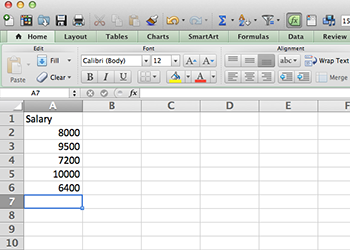|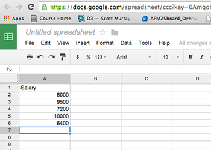|

In a spreadsheet, you *can* do the math yourself. You could, in A7, type `=(8000+9500+7200+10000+6400)/5` which would give you the average.

**But why do that?**

Typing is the devil. It's the devil because it's tedious. It's the devil because it's error prone. If I switch two numbers or type 5 instead of 6, I'm wrong. Once you have data, the less typing you do, the better.

In a spreadsheet, to calculate something with a set of numbers, you'll use something called a function. A function has a name, and takes inputs. If you're getting itchy, relax. Let's use the AVERAGE function in our spreadsheet of choice to illustrate this.

So first, remember that **formulas is a spreadsheet start with an equal sign.**

The second thing you need to know is that you have to tell your spreadsheet where all your numbers are. You can do this one of two ways. First, you could name them all individually (A2, A3, A4, A5, A6) but that puts us back into typing-is-the-devil territory. And, what if you have a thousand numbers? That would be awful. So there's a second way -- use a colon. To tell your spreadsheet that you want a range of numbers, you tell it the starting number, colon, ending number. So, in our case, our range will look like A2:A6.

The third is that you call a function -- you tell your spreadsheet you want to use this particular function -- by putting the name of it first, then your inputs in parentheses. Like this: `=FUNCTION(inputs)`

So putting that all together, the format for the AVERAGE function is `=AVERAGE(A2:A6)`

|In Excel|In Google Spreadsheets|
|--------|----------------------|
|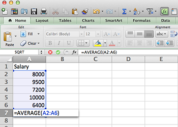|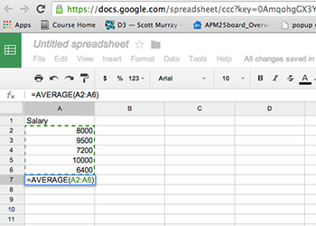|

And, when we hit enter, we get our answer: $8,220.

### How to turn a mean into a story

One of the main uses for an average is to compare how something fares against the middle. Is it above average or below average? And how much?

One thing you might want to do is compare your university's graduation rate compared to other schools like yours. For this example, [I've provided a CSV file of schools in the Big 10 athletic conference](https://www.dropbox.com/s/1pcft4ib0hq8mlx/colleges.csv?dl=0) that you should download (math alert: has 14 schools in it). If you'd like to get your own athletic conference, this data comes from the US federal Department of Educations [IPEDS](https://nces.ed.gov/ipeds/datacenter/Default.aspx) database.

Question: What is the average graduation rate among Big 10 schools?

Opening the file in Excel is easy -- go to File > Open and find where you put the file. Open it and it'll come up as a new workbook.

In Google Spreadsheets, it's also easy, but not quite as straightforward. In Google Spreadsheets, open up a new spreadsheet, go to File > Import. There, you'll get a new screen. First, click Choose File and find the data file called colleges.csv in the data folder that came with this tutorial. Click replace spreadsheet (which means the blank sheet you opened up will be replaced with actual data) and then hit import.

|In Excel|In Google Spreadsheets|
|--------|----------------------|
|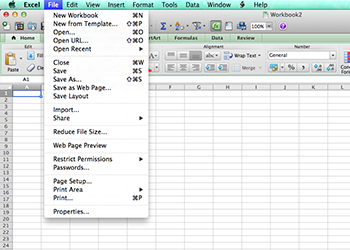|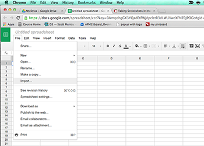|
||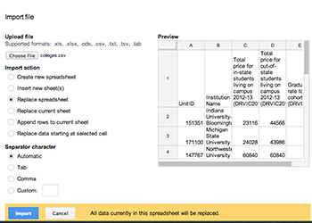|

> ### Pro Tip

> See how the data you just imported is cut off by the widths of the columns? Annoying, right? Here's how to fix that. See the rectangle to the left of column A and above row 1? Click it. That selects everything. Now, hover your mouse over the line between column A and B. See how it changed to something else? Double click that line. Boom. Automatically resizes every column to what's needed to show all the data. Much better now.

So you can see now we have five columns of data. A unit ID, the name of the institution, the cost of 30 credit hours -- or one academic year -- for in state students, that same cost for out-of-state students and the graduation rate of what's called the six-year cohort. That six-year cohort is the percent of students who had graduated who started six years before. That's the metric most universities look at to compare each other.

So, from our last example, we know we can go to row 16 column E and work our AVERAGE magic.

**Google spreadsheet users: You'll need to add a row to work with. There's a button at the bottom to just add 20 rows. That will work nicely.**

|In Excel|In Google Spreadsheets|
|--------|----------------------|
||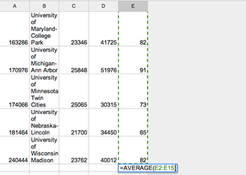|

And when we hit enter, we see that the Big 10 graduates 79.3 percent of students in six years. By eyeballing it, we can see some schools, like Northwestern, graduate nearly all of their students in six years. And, on the opposite end of the spectrum, we see the University of Nebraska-Lincoln, my employer, graduating only 65 percent of students in six years.

Uh oh.

So the first question that jumps out at you should be a very simple one: Why?

Congratulations. You got your first story idea from data. But is eyeballing it the best way to look at this? Nope.

## Minimums, maximums, sorting and ranking

### The basics

Often, when we're comparing things, we need to know what the highest and lowest numbers in our data set are. And, often it helps to put those in order from highest to lowest or lowest to highest. Doing that, we're often aiming toward a ranking of our numbers. When you have just a handful of numbers, any of these things can be done by hand with no real trouble. But spreadsheets give us the power to do this over thousands of data points. But before we do thousands, lets walk through a small set of examples.

### How to calculate a minimum, maximum, sort and rank

You do not want to do this by hand, especially if the list of numbers is longer than just a few. You can manually move them around, scan the list for the largest and smallest numbers, but if the list is very long, this is extremely error prone.

### How to calculate a minimum or maximum in a spreadsheet

In both Excel and Google Spreadsheets, there is a function for both minimum and maximum. They aren't hard to remember. `=MIN(FirstCellInRange:LastCellInRange)` and `=MAX(FirstCellInRange:LastCellInRange)` where the FirstCellInRange and LastCellInRange are a cell reference, like A2:A50 or whatever your data requires.

### How to turn a minimum or maximum into a story

Minimums and maximums, by themselves, are rarely interesting. We need to know what they're attached to in order for them to be interesting. To do that, it's better that we sort the data in Ascending or Descending order. Sorted in Ascending order, the smallest number is at the top, the biggest at the bottom. With Descending order, it's vice versa.

First things first: In either Google or Excel, click on the keystone. That's the blank rectangle left of column A and above row 1 in the upper left corner of your spreadsheet. By doing that, you'll select everything. Then in both spreadsheet platforms, sorting is found under Data. In Excel, it's under sort. In Google, it's sort range.

|In Excel|In Google Spreadsheets|
|--------|----------------------|
|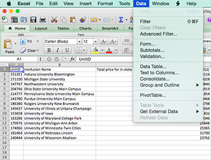|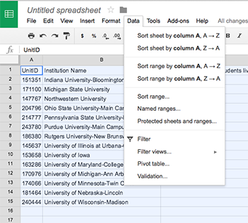|
|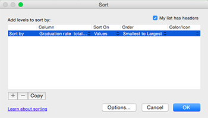|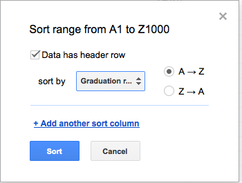|

For our example, select the Graduation Rate column and then select smallest to largest (or A-Z in Google). In both platforms, make sure that the header row check box is checked -- your data does have a header row, and it would be a pity to sort it into your data when you hit OK or sort. Which you should do.

And when you sort by lowest graduation rate, what comes up? Uh oh. The Harvard of the Plains doesn't look so good.

Now it would be time for you to go ask the most basic of all reporter questions: Why?

One last thing: Sometimes a sort just isn't enough. Editors love ranks. They love a good top X list. Spreadsheets will calculate ranks for you easily. And it's the same regardless of platform. It looks like this:

`=RANK(TheCellYouWantToRank,TheFirstCellInTheRange:TheLastCellInTheRange)` where `TheCellYouWantToRank` is, well, probably the row you're on. `TheFirstCellInTheRange` and `TheLastCellInTheRange` are what they say they are, the first and last cells in the column you want to rank against. So what the RANK function says is "Take this cell and rank it against all the values in this range." When you copy it down, it'll just do the next one, and the next, and the next. When you have 14 records, this isn't interesting. When you have thousands, and you're interested in some in the middle instead of the top and bottom, ranks are extremely interesting.

## Median

### The basics

The median is the value in the middle -- it's where half the values are higher, and half are lower. Averages are sensitive to extremes, as we've discussed. So things like salaries, home values and numbers that don't have some kind of constraint are vulnerable to the average's sensitivity to extremes. Medians, however, are not.

### How to calculate a median

Unfortunately, there's not an easy way to calculate a median using basic math. You really just have to sort them into order and look for the point where half are above and half are below. If you have tens of thousands of records, this is a giant waste of time.

### How to calculate a median in a spreadsheet

Fortunately, spreadsheets make medians easy. And again, it's the same regardless of your choice of platform.

`=MEDIAN(FirstCellInTheRange:LastCellInTheRange)`

So, with our college cost spreadsheet still open, let's compare the Average to the Median. Column C is the In State Cost and Column D is the Out of State Cost. Immediately underneath the last record, in row 16 and in column C, let's calculate the Average In State Cost. It's `=AVERAGE(C2:C15)` and you get $27652.86. Under that, in Row 17 Column C, let's calculate the Median In State Cost. To do that, it's `=MEDIAN(C2:C15)` and you get $24473.50. See that? The median is about $3,000 cheaper than the average. You can do the same with Out of State costs, but the difference is much less significant.

### How to turn a median into a story

In 2004, at the dawn of what would become a disasterous real-estate bubble, I was working at a newspaper in Florida, which was one of the key states in the whole mess. But at the time, people were just astonished at how fast homes were selling and for how much. So I set out to quantify it. And what we found was that neighborhood after neighborhood, street by street, the entire area was being transformed by skyrocketing home prices. The entire story was built on medians. I used geographic information systems -- maps -- to calculate the median sale prices of a home in a neighborhood in a given year and then I calculated the same median home price in the current year, and did a percent change calculation. [The project is still online](http://www.sptimes.com/2004/webspecials04/homeprices/).

## Percentages of a whole

### The basics

Percentages of a whole are a very basic measure of just how much of the whole a thing represents. It's a very simple measure, but one often confused by the less numerate. The trick is to just remember that it's simple. The basic formula is this: `The thing you are interested in that's part of a larger whole / the larger whole` or more compact `Thing/Everything`

### How to calculate a percentage

Let's look at crime. Murder in the United States gets a huge amount of the attention in the Media (writ large: How many cop/crime scene shows are there?). So how much of the whole does murder represent? The only real way to look at crime on a national level is to use the FBI's Uniform Crime Reports. It isn't perfect -- and the flaws are beyond the scope of this document -- but it's the only national dataset of crime by jurisdiction that we have. It measures 8 categories of crimes: Murder, Rape, Robbery, Aggravated Assault, Larceny, Burglary, Motor Vehicle Theft and Arson.

In this UCR dataset I've provided, there is every local jurisdiction reporting to the FBI, their population in 2014, the total number of violent crimes and the total number of murders reported.

Let's look at New York City. In 2014, New York City reported 333 murders and 50,544 violent crimes. To get what percentage of violent crimes murder represents in New York City you take 333 and divide it by 50,544. You'll get a really small number: .00659 or so. That's a decimal. To make it a percentage, we have to multiply it by 100 or just move the decimal point two places to the rigth. You still get a really small number: .6 percent. That's right. Murder in New York, home of half the cop shows on television, represents less than 1 percent of all violent crimes.  

### How to calculate a percentage in a spreadsheet

But does anywhere stand out? Lets's calculate it in a spreadsheet and find out. In the dataset, there's 9,347 jurisdictions. To make things easier, I've removed everywhere that didn't report any murders. I'm delighted to report that cuts the number of places that reported murders to 1,777 (or, if you're curious, that's 19 percent of all police jurisdictions in the US reported 1 or more murders).

Open the file -- [you can download it here](https://www.dropbox.com/s/vvyplhzkd5ykbga/murders.csv?dl=0) -- and in Column F, Row 1, let's add a new header called Percentage.

Then, in Column F Row 2, let's calculate our percentage. So we want to take the subset (murders in this case) and divide it by the total (violent crimes). So our formula will look like this: `=E2/D2`

Really, that's it. Copy the formula down by double clicking on the notch on the bottom left of the cell. Now sort it largest to smallest (descending order). What do you get?

### How to turn a percentage into a story

Percents of a whole end up in stories all over the place. In the case of our murder data here, I'd want to know about all those small towns that reported only one violent crime, and it was a murder. So there was no other violent crime in the town for a whole year? Not one person got in a bar fight? No one hit a family member? Nothing? Really? That doens't pass the smell test.

## Percent change

### The basics

Calculating percent change is where newsrooms divide the Math Capable from Everyone Else. In some newsrooms, if you can calculate percent change, you are seen as some kind of magician, a conjurer of dark arts not to be understood by mere mortals.

It's pathetic.

Calculating percent change is easy if you can remember this simple formula: `New minus old divided by old` or, more mathematically `(New-Old)/Old`

That's it. Take your new number, from this year say, subtract last years figure from it, and then divide by last years figure. If it's a positive number, the number grew year over year. If it's negative, it shrunk year over year. And what comes out will be a small number that you'll need to multiply by 100 to get the percentage.

### How to calculate a percent change

Let's take a fictional professor in your university. This professor this year makes $66,000 a year. Last year, the professor made $65,000 a year. What is the percentage change in the professor's salary?

Remember the formula?

`(New-Old)/Old` or `(66000-65000)/65000` is .0153846 or 1.5 percent (take that small number and multiply by 100 to get the percentage).

### How to calculate a percent change in a spreadsheet

Percent changes are extremely common in spreadsheets and data journalism. And this is where they shine. For both Google and Excel, the formula is the same.

Let's try a new dataset. This one is called population.csv -- [download it here](https://www.dropbox.com/s/nqs144kwpaxcc2q/population.csv?dl=0) -- and it is the estimated population of every county in the US. This is a dataset released every year by the U.S. Census Bureau, and it's the best guess they have on how many people live in a county between the every 10 year census that counts everyone. It's also a great way to see if your county is growing or not, and how fast in relation to others in the state or country.

Open the file in your spreadsheet software -- File/Open in Excel, File/Import in Google -- and take a look. It's pretty simple. The first thing we're going to do is create a new header at the end of the filled columns. Click on the first empty box in row one, next to POPESTIMATE15 and type Change.

Now, in the box below, and remembering that all spreadsheet formulas start with an equal sign, we're going to enter our percent change formula. In this case, it's:

`=(J2-E2)/E2`

|In Excel|In Google Spreadsheets|
|--------|----------------------|
|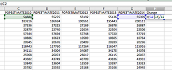|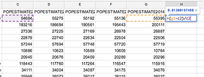|

**NOTE: The screenshots are from a previous iteration and have not been updated yet. The formula above is correct. The screenshots here are for visual reference.**

When you hit enter, you'll have the percent change in population for Autauga County, Alabama.

Great. But where's that? Do I have to type this formula another 3,400 times to get them all?

Nope.

Click back on the cell that has the percent change you just calculated in it. See the small black square on the bottom right corner of you box? Double click that.

And just like that, you've calculated the percent change in population in every county in the United States.

### How to turn a percent change into a story

Percent changes by themselves are rarely interesting, but what happens if we add a sort to this? Remember, we can sort two ways. What stories pop out when you sort for the fastest shrinking counties first? What happens when you sort for fastest growing? Do national stories emerge? Do local stories emerge? What are they?

# COMING SOON

## Probability

### The basics

### How to calculate a probability

### How to calculate probability in a spreadsheet

### How to turn a probability into a story

## Odds

### The basics

### How to calculate odds

### How to calculate odds in a spreadsheet

### How to turn the odds into a story

## Equations of a line

### The basics

### How to calculate slope and find the equation of a line

### How to calculate slope and the equation of a line in a spreadsheet

### How to turn the equation of a line into a story
